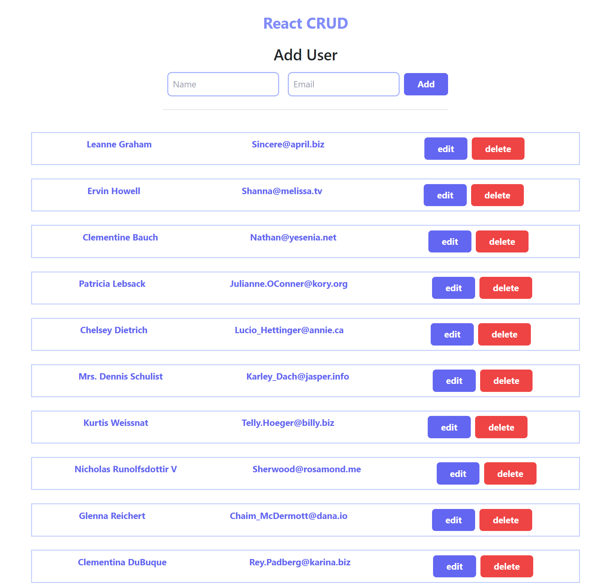

# React CRUD

## Details

### Brief description

This is a [React](https://react.dev/) project bootstrapped with [`create-react-app`](https://github.com/facebook/create-react-app)

create, read, update, delete operations using jsonplaceholder

### Features

CRUD operations

### Technologies used

react, tailwindcss, bootstrap, axios

## Getting Started

### Pre-requisites

Node.js, NPM, code editor like VSCode.

### Install project dependencies

```bash
npm install
```

### Run development server

```bash
npm start
```

Open [http://localhost:3000](http://localhost:3000) with your browser to see the result.

## Screenshots




